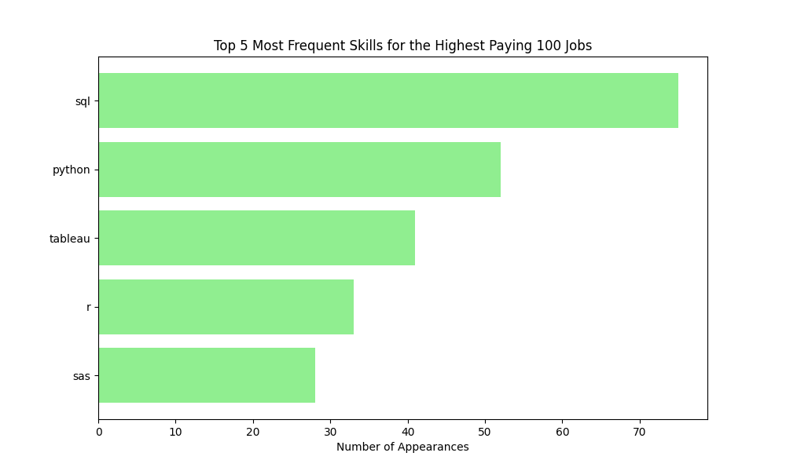
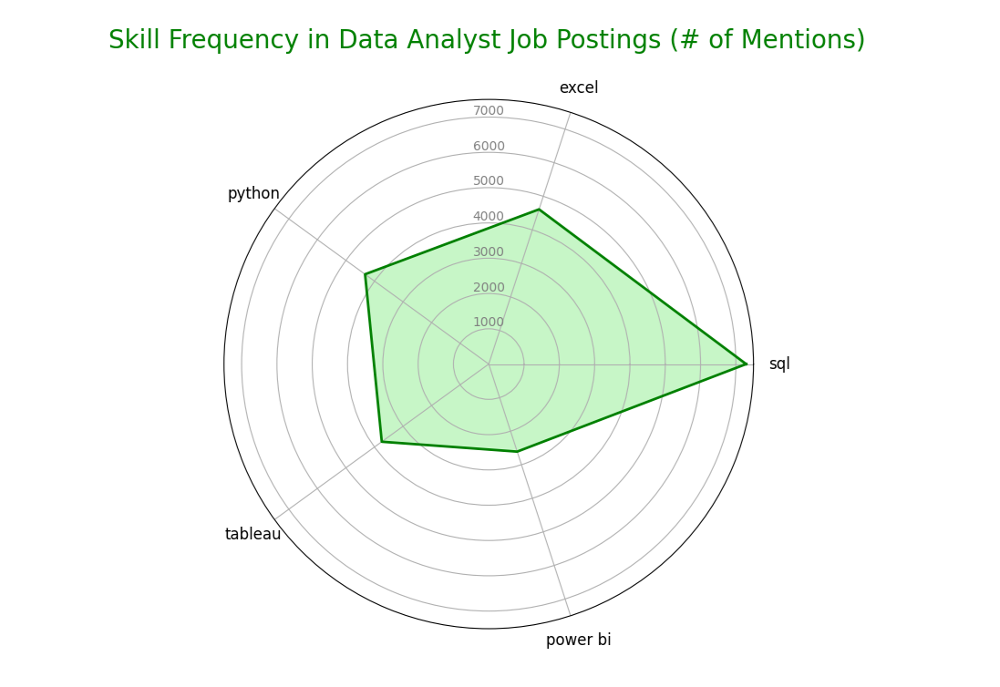
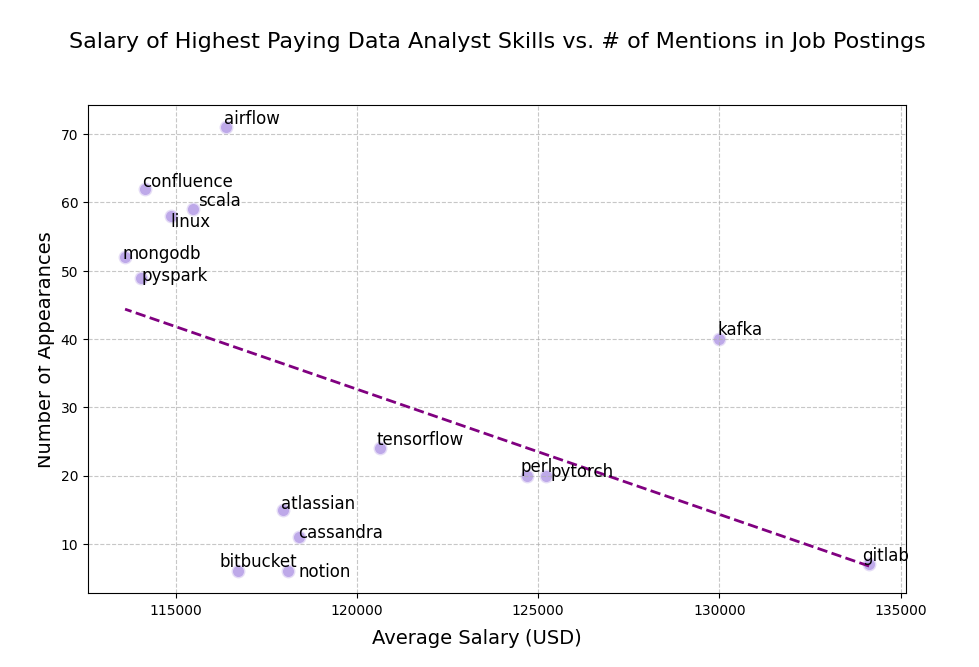

# Introduction
For this project I decided to dive into the job market while focusing on data analyst roles. I analyze the highest paying roles and what comprises them.

Check out SQL queries here: [project_sql folder](/project_sql).
# Background
I started this project to pinpoint top-paid and in-demand skills, streamlining training for data analyst roles to find optimal jobs.

I obtained my data from [here](https://lukebarousse.com/sql), where a data analyst already neatly collected this data for the year of 2023 and formatted it into data tables.

### The questions I wanted to answer were as follows:

1. What are the top-paying data analyst jobs?

2. What are the skills associated with these top-paying data analyst jobs?

3. What are the most in-demand Data Analyst skills?

4. What are the highest paying Data Analyst skills?

5. What are the most optimal skills to learn?

# Tools I Used

For this analysis fo the data analyst job market, I used several key tools:

- **SQL**: My primary tool, which allowed me to query my job market database and unearth critical insights.

- **PostgreSQL**: My chosen database management system; it's open-source and ideal for handling the job posting data.

- **Python**: I use the pandas and matplotlib packages to build some visualizations for my data.

- **Git & GitHub**: Essential for version control and sharing my SQL scripts and analysis, ensuring collaboration and project tracking.

# The Analysis

Each query for this project aimed at investigating specific aspects of the data analyst job market. Here's how I approached each question:

### 1. Top Paying Data Analyst Jobs
To identify the highest-paying roles, I filtered data analyst positions by average yearly salary and location, and I focused on remote jobs. This query highlights some of the exceptionally high-paying roles in the field.

```sql
SELECT
    job_id,
    job_title,
    job_location,
    job_schedule_type,
    salary_year_avg,
    job_posted_date::date,
    name AS company_name
FROM
    job_postings_fact
LEFT JOIN 
company_dim 
ON
job_postings_fact.company_id = company_dim.company_id
WHERE
    job_title_short = 'Data Analyst' AND
    job_location = 'Anywhere' AND 
    salary_year_avg IS NOT NULL
ORDER BY
    salary_year_avg DESC
LIMIT
    10
```
Here's some analysis of the findings:

- Top-Paying Remote Data Analyst Positions: The highest-paying remote Data Analyst job offers an annual average salary of $650,000 at Mantys. This is significantly higher than the second highest, which is $336,500 at Meta for the role of Director of Analytics. This indicates a wide range in salary offerings depending on the specific job title and company.

- Diverse Range of Companies Offering Top Salaries: The top 10 list includes a variety of companies such as Meta, AT&T, Pinterest, and UCLA Healthcare Careers. This demonstrates that high-paying opportunities for remote Data Analysts are available across different industries, from social media and telecommunications to healthcare and education.


### 2. Skills Associated With Top-Paying Remote Data Analyst Jobs

For the top 100 highest paying Data Analyst jobs, these are the top 5 skills with the highest average salaries:



As we can see from the figure, even for the most high paying jobs, the most sought after skills are what one would expect from a data analyst, like SQL for data querying, Python, R, and SAS for statistical analysis, and Tableau for data visualizations. Here is the SQL query I performed to retrieve these results:

```sql
WITH top_paying_jobs AS (
    SELECT
        job_id,
        job_title,
        salary_year_avg,
        name AS company_name
    FROM
        job_postings_fact
    LEFT JOIN 
    company_dim 
    ON
    job_postings_fact.company_id = company_dim.company_id
    WHERE
        job_title_short = 'Data Analyst' AND
        job_location = 'Anywhere' AND 
        salary_year_avg IS NOT NULL
    ORDER BY
        salary_year_avg DESC
    LIMIT
        100
)

SELECT 
    AVG(salary_year_avg) AS avg_salary_per_skill,
    COUNT(*) AS number_of_appearances,
    skills
FROM 
    top_paying_jobs
INNER JOIN 
    skills_job_dim
ON
    top_paying_jobs.job_id = skills_job_dim.job_id
INNER JOIN
    skills_dim
ON
    skills_job_dim.skill_id = skills_dim.skill_id
GROUP BY
    skills
ORDER BY
    avg_salary_per_skill DESC;
```

### 3. Skills Associated With All Remote Data Analyst Jobs

When we compare this information with all data analyst jobs (not just high-paying), we can find similar results. However, Excel and Power BI take the place of SAS and R. These results make sense, because higher paying jobs would likely be more analysis driven, whereas the average data analyst should know how to use a more basic spreadsheet editor like Excel and create visualizations with tools like Power BI or Tableau.



Here is the SQL query I performed to retrieve these results:

```sql
SELECT 
    skills,
    COUNT(skills_job_dim.job_id) AS demand_count
FROM 
    job_postings_fact
INNER JOIN 
    skills_job_dim
ON
    job_postings_fact.job_id = skills_job_dim.job_id
INNER JOIN
    skills_dim
ON
    skills_job_dim.skill_id = skills_dim.skill_id
WHERE
    job_title_short = 'Data Analyst' AND
    job_work_from_home = TRUE
GROUP BY
    skills
ORDER BY
    demand_count DESC
LIMIT 5
```

### 4. Highest Paying Data Analyst Skills

In this analysis I examine the skills with the highest paying associated average salary. For my query, I included a "HAVING" clause such that only skills mentioned more than five times in job descriptions would be included. This removes any high-paying skills that might be included that are one-off skills for a specific job description, and learning a skill that is only useful for one job is not worthwhile. 

- What I specifically found with my analysis is that high-paying skills like Kafka and PyTorch highlight the importance of specialized knowledge in modern data engineering and machine learning frameworks. These technologies are critical for handling large-scale data processing and developing advanced machine learning models, which likely explains their high remuneration.

- On the other end of the spectrum, skills like MongoDB, PySpark, and Confluence, while still among the top 15 highest-paying, appear more frequently in job postings. This suggests that while these skills are highly valued, they are also more common and thus may offer slightly lower average salaries compared to more niche skills like GitLab. The scatter plot below visualizes the relationship between average salary and the number of job appearances for each skill, providing a clearer picture of how demand and remuneration interact for Data Analyst positions. I included a line of best fit, however, the correlation coefficient for this linear model is -.49, indicating a weak, negative linear trend between Average Salary and the Number of Appearances in job descriptions. Thus, there is unlikely to be a linear relationship between these two variables, and I have found this to be true for the rest of my analysis. 



One skill that stands out to me specifically is Kafka, an AWS distributed data store optimized for ingesting and processing streaming data in real-time, since it is associated with a quite large average salary ($129999) and mentioned in job descriptions a meaningful number of times (40).

Here is the SQL query I ran to retrieve this data:

```sql
SELECT 
    skills,
    ROUND(AVG(salary_year_avg), 0) AS avg_salary_per_skill,
    COUNT(*) AS number_of_appearances
FROM 
    job_postings_fact
INNER JOIN 
    skills_job_dim
ON
    job_postings_fact.job_id = skills_job_dim.job_id
INNER JOIN
    skills_dim
ON
    skills_job_dim.skill_id = skills_dim.skill_id
WHERE
    job_title_short = 'Data Analyst' AND 
    salary_year_avg IS NOT NULL
GROUP BY
    skills
HAVING
    COUNT(*) >5
ORDER BY
    avg_salary_per_skill DESC
LIMIT 15
```

### 5. Optimal Skills

Now we are getting at the root of the main question we wish to answer with our analysis: What skills should a data analyst learn in order to be successful?

The short and unsatisfactory answer is that it depends. It depends on what that data analyst's definition of success is. Do they care about obtaining a high salary? Do they want a job as quick as possible? Or are they somewhere else along that spectrum?

If the hypothetical data analyst answered yes to the first question and no to the second question, then they would be more interested in jobs associated with high salaries and care less about how often a skill is mentioned across job descriptions, and vice-versa if they answered no to the first question and yes to the second. 

To better address this spectrum of varying wants for the job-seeker, I built a weighted score that is dependent on an individual's rankings of the importance of skill frequency and that of skill value. This weighted score operates under the basic economic belief that the ideal job-seeker is both in-demand and of high value. I created this weighted score using normalized values for both average salary per skill and skill demand count. For me personally, a higher salary and flexibility in the number of job postings relevant to my skill set are equally important, so I gave "Demand Count" and "Average Salary Per Skill" an equal weight of .5. I created an interactive tool within Mathematica to demonstrate these results, then I embedded this tool into JavaScript which can be found [here](https://jsfiddle.net/TroddCheeseburger/pqv9gwn5/).

Include video here.

My SQL query is quite complicated, but I wanted to practice using CTEs. I order by "Weighted Score" descending:

```sql
WITH skills_demand AS (
    SELECT
        skills_dim.skill_id, 
        skills,
        COUNT(skills_job_dim.job_id) AS demand_count
    FROM 
        job_postings_fact
    INNER JOIN 
        skills_job_dim
    ON
        job_postings_fact.job_id = skills_job_dim.job_id
    INNER JOIN
        skills_dim
    ON
        skills_job_dim.skill_id = skills_dim.skill_id
    WHERE
        job_title_short = 'Data Analyst' AND 
        salary_year_avg IS NOT NULL
    GROUP BY
        skills_dim.skill_id
), avg_salary AS (
    SELECT 
        skills_dim.skill_id,
        skills,
        ROUND(AVG(salary_year_avg), 0) AS avg_salary_per_skill
    FROM 
        job_postings_fact
    INNER JOIN 
        skills_job_dim
    ON
        job_postings_fact.job_id = skills_job_dim.job_id
    INNER JOIN
        skills_dim
    ON
        skills_job_dim.skill_id = skills_dim.skill_id
    WHERE
        job_title_short = 'Data Analyst' AND 
        salary_year_avg IS NOT NULL
    GROUP BY
        skills_dim.skill_id
), normalized_values AS (
    SELECT  
        skills_demand.skill_id,
        skills_demand.skills,
        demand_count,
        avg_salary_per_skill,
        -- Normalize demand_count
        (CAST(demand_count AS FLOAT) - (SELECT MIN(demand_count) FROM skills_demand)) / 
        ((SELECT MAX(demand_count) FROM skills_demand) - (SELECT MIN(demand_count) FROM skills_demand)) AS normalized_demand,
        -- Normalize avg_salary_per_skill
        (CAST(avg_salary_per_skill AS FLOAT) - (SELECT MIN(avg_salary_per_skill) FROM avg_salary)) / 
        ((SELECT MAX(avg_salary_per_skill) FROM avg_salary) - (SELECT MIN(avg_salary_per_skill) FROM avg_salary)) AS normalized_salary
    FROM
        skills_demand
    INNER JOIN avg_salary
    ON
        skills_demand.skill_id = avg_salary.skill_id
),
weighted_scores AS (
    SELECT
        skill_id,
        skills,
        demand_count,
        avg_salary_per_skill,
        normalized_demand,
        normalized_salary,
        -- Calculate weighted score with demand given slightly more weight
        (0.5 * normalized_demand + 0.5 * normalized_salary) AS weighted_score
    FROM
        normalized_values
)
SELECT
    DISTINCT skills,
    ROUND(CAST(weighted_score AS numeric), 4) AS weighted_score,
    demand_count,
    avg_salary_per_skill
FROM
    weighted_scores
WHERE
    demand_count > 20
ORDER BY
    weighted_score DESC,
    avg_salary_per_skill DESC
LIMIT
    25;
```


# Conclusion

TBD