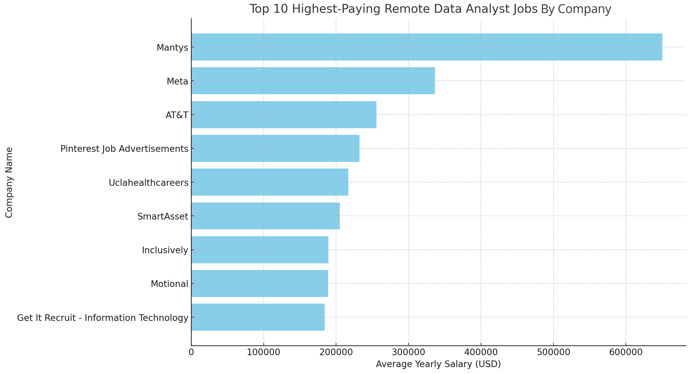

# Introduction
For this project I decided to dive into the job market while focusing on data analyst roles. I analyze the highest paying roles and what comprises them.

Check out SQL queries here: [project_sql folder](/project_sql).
# Background
I started this project to pinpoint top-paid and in-demand skills, streamlining training for data analyst roles to find optimal jobs.

I obtained my data from [here](https://lukebarousse.com/sql), where a data analyst already neatly collected this data for the year of 2023 and formatted it into data tables.

### The questions I wanted to answer were as follows:

1. What are the top-paying data analyst jobs?

2. What are the skills associated with these top-paying data analyst jobs?

3. What are the most in-demand Data Analyst skills?

4. What are the highest paying Data Analyst skills?

5. What are the most optimal skills to learn?

# Tools I Used

For this analysis fo the data analyst job market, I used several key tools:

- **SQL**: My primary tool, which allowed me to query my job market database and unearth critical insights.

- **PostgreSQL**: My chosen database management system; it's open-source and ideal for handling the job posting data.

- **Python**: I use the pandas and matplotlib packages to build some visualizations for my data.

- **Git & GitHub**: Essential for version control and sharing my SQL scripts and analysis, ensuring collaboration and project tracking.

# The Analysis

Each query for this project aimed at investigating specific aspects of the data analyst job market. Here's how I approached each question:

### 1. Top Paying Data Analyst Jobs
To identify the highest-paying roles, I filtered data analyst positions by average yearly salary and location, and I focused on remote jobs. This query highlights some of the exceptionally high-paying roles in the field.

```sql
SELECT
    job_id,
    job_title,
    job_location,
    job_schedule_type,
    salary_year_avg,
    job_posted_date::date,
    name AS company_name
FROM
    job_postings_fact
LEFT JOIN 
company_dim 
ON
job_postings_fact.company_id = company_dim.company_id
WHERE
    job_title_short = 'Data Analyst' AND
    job_location = 'Anywhere' AND 
    salary_year_avg IS NOT NULL
ORDER BY
    salary_year_avg DESC
LIMIT
    10
```
Here's some analysis of the findings:

- Top-Paying Remote Data Analyst Positions: The highest-paying remote Data Analyst job offers an annual average salary of $650,000 at Mantys. This is significantly higher than the second highest, which is $336,500 at Meta for the role of Director of Analytics. This indicates a wide range in salary offerings depending on the specific job title and company.

- Diverse Range of Companies Offering Top Salaries: The top 10 list includes a variety of companies such as Meta, AT&T, Pinterest, and UCLA Healthcare Careers. This demonstrates that high-paying opportunities for remote Data Analysts are available across different industries, from social media and telecommunications to healthcare and education.



### 2. Skills Associated With Top-Paying Data Analyst Jobs

For the top 100 highest paying Data Analyst jobs, these are the top 5 skills with the highest average salaries:


As we can see from the figure, even for the most high paying jobs, the most sought after skills are what one would expect from a data analyst, like SQL for data querying, Python, R, and SAS for statistical analysis, and Tableau for data visualizations. Here is the SQL query I performed to retrieve these results:

```sql
WITH top_paying_jobs AS (
    SELECT
        job_id,
        job_title,
        salary_year_avg,
        name AS company_name
    FROM
        job_postings_fact
    LEFT JOIN 
    company_dim 
    ON
    job_postings_fact.company_id = company_dim.company_id
    WHERE
        job_title_short = 'Data Analyst' AND
        job_location = 'Anywhere' AND 
        salary_year_avg IS NOT NULL
    ORDER BY
        salary_year_avg DESC
    LIMIT
        100
)

SELECT 
    AVG(salary_year_avg) AS avg_salary_per_skill,
    COUNT(*) AS number_of_appearances,
    skills
FROM 
    top_paying_jobs
INNER JOIN 
    skills_job_dim
ON
    top_paying_jobs.job_id = skills_job_dim.job_id
INNER JOIN
    skills_dim
ON
    skills_job_dim.skill_id = skills_dim.skill_id
GROUP BY
    skills
ORDER BY
    avg_salary_per_skill DESC;
```

### 3. Skills Associated With All Remote Data Analyst Jobs

When we compare this information with all data analyst jobs (not just high-paying), we can find similar results. However, Excel and Power BI take the place of SAS and R. These results make sense, because higher paying jobs would likely be more analysis driven, whereas the average data analyst should know how to use a more basic spreadsheet editor like Excel and create visualizations with tools like Power BI or Tableau.


Here is the SQL query I performed to retrieve these results:

```sql
SELECT 
    skills,
    COUNT(skills_job_dim.job_id) AS demand_count
FROM 
    job_postings_fact
INNER JOIN 
    skills_job_dim
ON
    job_postings_fact.job_id = skills_job_dim.job_id
INNER JOIN
    skills_dim
ON
    skills_job_dim.skill_id = skills_dim.skill_id
WHERE
    job_title_short = 'Data Analyst' AND
    job_work_from_home = TRUE
GROUP BY
    skills
ORDER BY
    demand_count DESC
LIMIT 5
```

### 4. Highest Paying Data Analyst Skills


# Conclusion